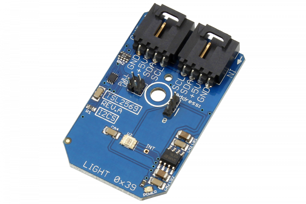

# TSL2569

The TSL2569 is a light-to-digital converter that transforms light intensity to a digital signal output.This device has a 400 kHz communication speed and 16-bit data output. The TSL2569 automatically rejects 50/60Hz lighting ripple and is highly sensitive with a dynamic range of 1,000,000:1, making it ideal for various lighting conditions.
This Device is available from www.ncd.io 

[SKU: TSL2569]

(https://store.ncd.io/product/tsl2569-16-bit-light-to-digital-converter-programmable-gain-i2c-mini-module/)
This Sample code can be used with Arduino.

Hardware needed to interface TSL2569 sensor with Arduino

1. <a href="https://store.ncd.io/product/i2c-shield-for-arduino-nano/">Arduino Nano</a>

2. <a href="https://store.ncd.io/product/i2c-shield-for-arduino-micro-with-i2c-expansion-port/">Arduino Micro</a>

3. <a href="https://store.ncd.io/product/i2c-shield-for-arduino-uno/">Arduino uno</a>

4. <a href="https://store.ncd.io/product/dual-i2c-shield-for-arduino-due-with-modular-communications-interface/">Arduino Due</a>

5. <a href="https://store.ncd.io/product/tsl2569-16-bit-light-to-digital-converter-programmable-gain-i2c-mini-module/">TSL2569 16Bit Light to Digital Converter Sensor</a>

6. <a href="https://store.ncd.io/product/i%C2%B2c-cable/">I2C Cable</a>

TSL2569:

TThe TSL2569 is a light-to-digital converter that transforms light intensity to a digital signal output.This device has a 400 kHz communication speed and 16-bit data output. The TSL2569 automatically rejects 50/60Hz lighting ripple and is highly sensitive with a dynamic range of 1,000,000:1, making it ideal for various lighting conditions.

Applications:

• Approximates human eye response

• Automatically rejects 50/60Hz lighting ripple

• Low active power (0.75mW typical) with power down mode

How to Use the TSL2569 Arduino Library

The TSL2569 has a number of settings, which can be configured based on user requirements.
          
1.Gain setting:The following command is used to set the gain of sensor.

              tsl.setGain(GAIN_16X);                                  // 16X
            
2.Integration time:The following command is used to set the integeration time.

              tsl.setIntegTime(INTEGRATIONTIME_13_7MS);               // 13.7 ms
            
